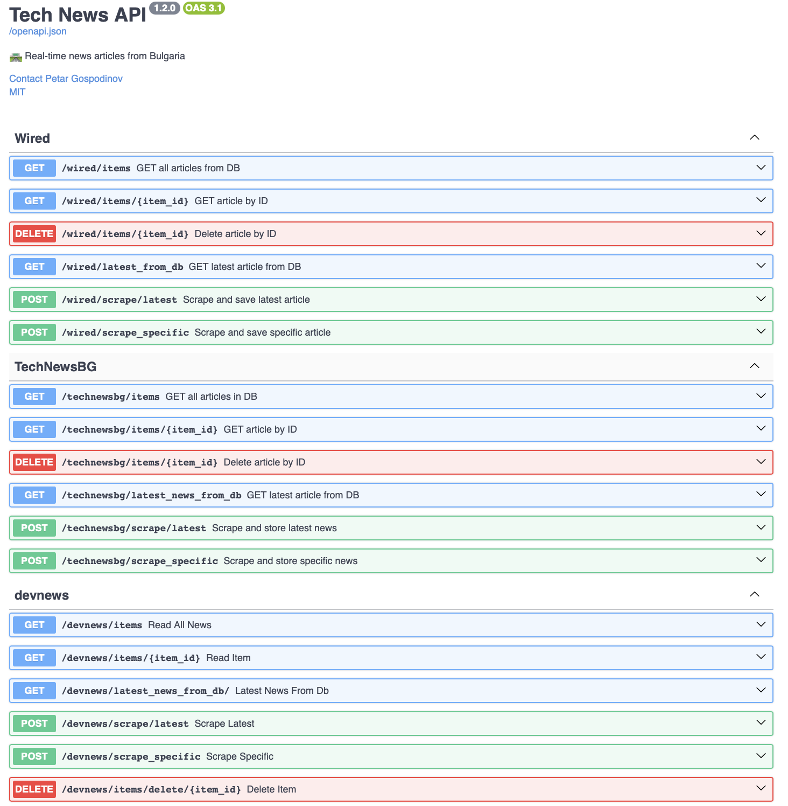
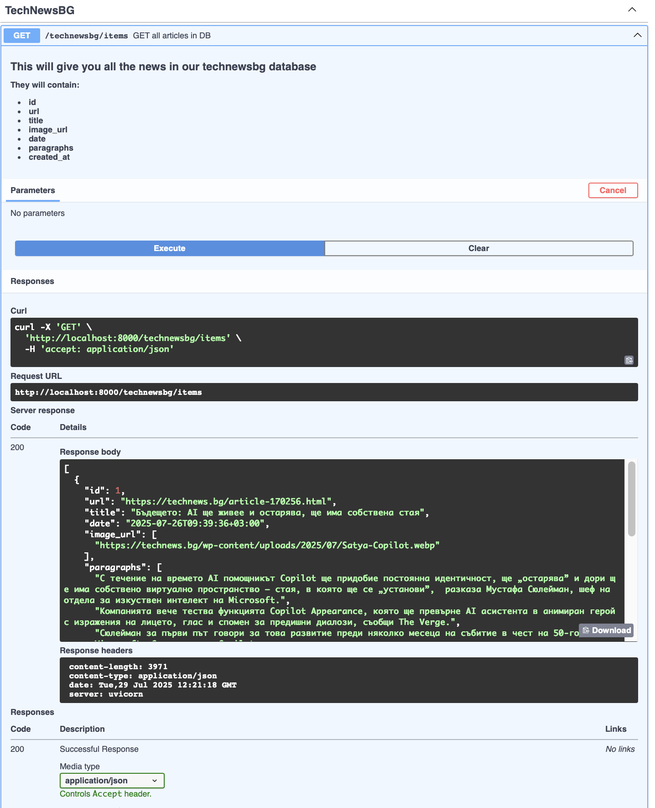
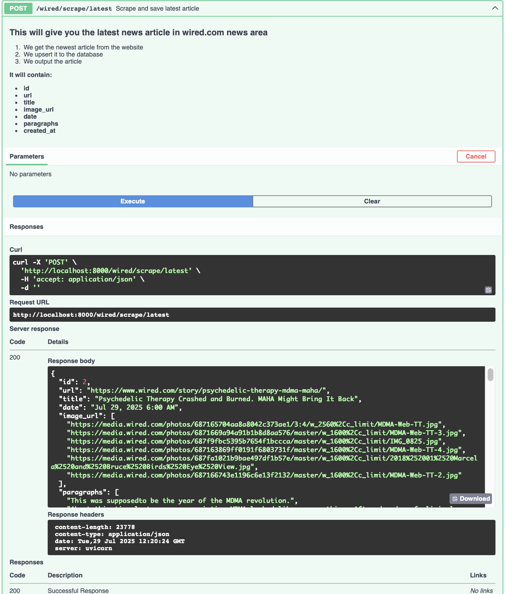

# 📰 Mid Project News Scraper

[]()
[]()

> **A unified scraping & API service** for aggregating news from multiple sites into a single mobile-friendly
> feed.

---

## 📖 Table of Contents

1. [🚀 Project Summary](#-project-summary)
2. [🔧 Architecture & Data Flow](#-architecture--data-flow)
3. [⚙️ Setup & Running](#-setup--running)
4. [📡 Example API Calls](#-example-api-calls)
5. [📸 Screenshots](#-screenshots)
6. [🛠 Logging](#-logging)
7. [🤝 Contributing](#-contributing)
8. [📄 License](#-license)

---

## 🚀 Project Summary

This repository hosts individual scrapers for three news websites:

* **Tech News** (`technews.bg`)
* **Dev BG News** (`dev.bg`)
* **Wired** (`wired.com`)

Each scraper:

1. **Fetches** the latest articles using HTTP requests.
2. **Parses** relevant fields: title, URL, publication date, image, and content.
3. **Stores** articles in PostgreSQL tables named per site:

    * `devnews_articles`
    * `technewsbg_articles`
    * `wired_articles`

By aggregating these sources, you can power a **mobile app** to deliver all headlines & articles in one
cohesive experience.

---

## 🔧 Architecture & Data Flow

| Component       | Location / Modules                                                                   | Responsibility                                                                                                                                                                                 |
|-----------------|--------------------------------------------------------------------------------------|------------------------------------------------------------------------------------------------------------------------------------------------------------------------------------------------|
| **Scrapers**    | `app/scrapers/devbgnews.py`<br>`app/scrapers/technews.py`<br>`app/scrapers/wired.py` | • Identify latest article links <br>• Extract fields: title, url, image\_url, date, paragraphs                                                                                                 |
| **Database**    | `database/models.py`, `database/session.py`                                          | • SQLAlchemy ORM with PostgreSQL <br>                                                                                                                                                          |
| **API Service** | `app/main.py` + `app/routers/{devbgnews, technewsbg, wired}.py`                      | • FastAPI endpoints for each site:<br>  - `GET /{site}/latest`<br>  - `POST /{site}/scrape`<br>  - `GET /{site}/items`<br>  - `DELETE /{site}/items/{id}`<br>• Supports pagination & filtering ||

---

## ⚙️ Setup & Running

### 1. Clone Repository

```bash
git clone https://github.com/GospodinovPetar/python_strypes_projects.git
cd fastapi/Mid_project
```

### 2. Configure Environment Configure Environment

```bash
cp env.example .env
# Edit .env:
# POSTGRES_USER=
# POSTGRES_PASSWORD=
# POSTGRES_DB=
# POSTGRES_HOST=
```

### 3. Launch with Docker Compose

```bash
docker-compose up --build
```

* **Services started:**

    * `postgres` (PostgreSQL)
    * `web` (FastAPI server at [http://localhost:8000](http://localhost:8000))
    * `pgadmin` (pgAdmin for Postgres)

> *Tip: Use a cron or scheduler to `POST /{site}/scrape` periodically.*

---

## 📡 Example API Calls

Use the `{site}` placeholder for any of: `technewsbg`, `wired`, `devnews`.

* **Read Latest Article**

  ```bash
  curl http://localhost:8000/{site}/latest
  ```

  Retrieves the most recently stored article from the database.

* **Read All Articles**

  ```bash
  curl http://localhost:8000/{site}/items
  ```

  Retrieves all stored articles. Supports optional filtering and pagination via query parameters:

    * `date_from=YYYY-MM-DD` – Articles published after this date.
    * `date_to=YYYY-MM-DD` – Articles published before this date.
    * `keyword=search_term` – Articles containing the keyword.
    * `offset=10` – Number of articles to skip (for pagination).
    * `limit=5` – Number of articles per page (default: 10).
  

* **Read Article by ID**
  ```bash
  curl http://localhost:8000/{site}/items/{id}
  ```
  Retrieves a single article by its database ID.


* **Scrape Latest Article**

  ```bash
  curl -X POST http://localhost:8000/{site}/scrape/latest
  ```
  Scrapes the newest article from the site feed and stores it in the database.

* **Delete an Article**
  ```bash
  curl -X DELETE http://localhost:8000/{site}/items/{id}
  ```
  Deletes the specified article by its database ID.

## 📸 Screenshots



---

## 🛠 Logging
### Logging is saved in [here](app/logger/logs/app.log)
Here is a quick example:
```
2025-07-26 12:53:49 INFO     [news_api] [WIRED] Fetching all articles from DB
2025-07-26 12:54:10 INFO     [news_api] [WIRED] Fetching article 1
2025-07-26 12:54:16 INFO     [news_api] [WIRED] Fetching latest article from DB
2025-07-26 12:54:23 INFO     [news_api] [WIRED] Deleted article 1
2025-07-26 12:54:37 INFO     [news_api] [WIRED] Saved latest article to DB
2025-07-26 12:54:46 INFO     [news_api] [WIRED] Deleted article 2
2025-07-26 12:54:49 INFO     [news_api] [WIRED] Delete failed, article 12 not found
2025-07-26 12:55:02 INFO     [news_api] [WIRED] Saved specific article to DB
2025-07-26 12:55:11 INFO     [news_api] [TECHNEWSBG] Fetching all articles from DB

```

---

## 🤝 Contributing

1. Fork & branch
2. Make your changes
3. Submit a pull request

Please follow our [Code of Conduct](CODE_OF_CONDUCT.md).

---

## 📄 License

Distributed under the GNU General Public License
> _Created by Petar Gospodinov_  
